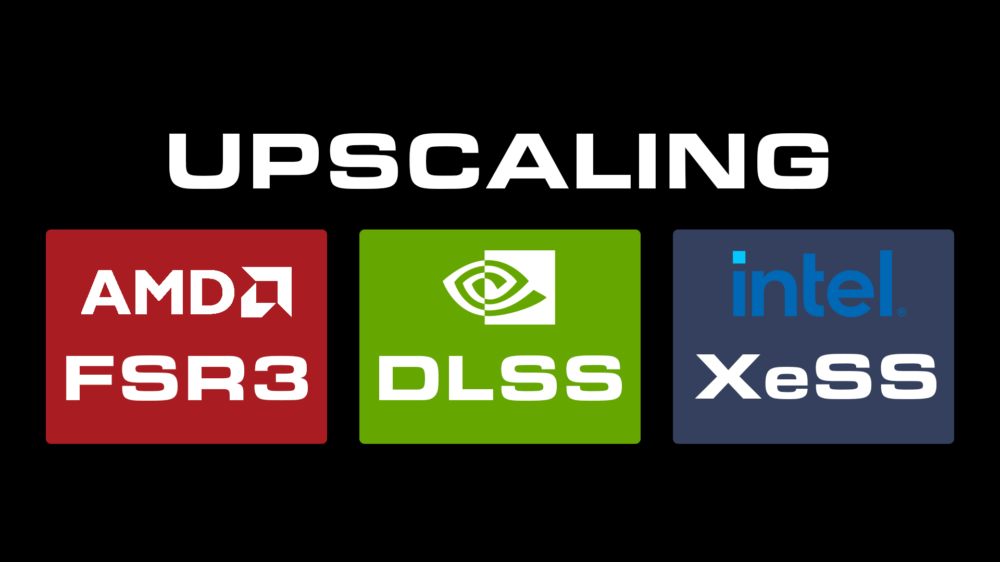

<div align="center">



# F4R Upscaling

**Upscaling for Fallout 4 (DLSS · FSR 3.1.5 · XeSS) as an F4SE plugin.**

This is the combined development repo and builds `F4R_Upscaling.dll`, `DLSS.dll`, `FSR3.dll`, `XeSS.dll`.

<br>

[](#requirements)
[](CMakeLists.txt)
[](https://www.gnu.org/licenses/gpl-3.0.html)

<sub>[Requirements](#requirements) · [Features](#features) · [Building](#building) · [License](#license)</sub>

</div>

---

## Requirements

| | |
|---|---|
| **Fallout 4** | OG & NG & AE |
| **[F4SE](https://f4se.silverlock.org/)** | Required. |
| **[Address Library for F4SE Plugins](https://www.nexusmods.com/fallout4/mods/47327)** | Required. |

## Features

| Method | Description |
|---|---|
| **DLSS** | DLSS Upscaling via the Streamline (RTX GPU). Replaces the vanilla TAA with a cleaner, sharper image and optional DLAA mode. |
| **FSR 3** | AMD FSR 3.1.5 Upscaling and Native AA with RCAS sharpness control. Works on any GPU, also usable as pure AA replacement without upscaling. |
| **XeSS** | Intel AI upscaling with DP4a fallback, so it runs on non-Intel GPUs too. Good middle ground between DLSS quality and FSR compatibility. |

---

## Building

Dependencies:

- A C++ 23 compiler (MSVC 2026)
- [vcpkg](https://github.com/microsoft/vcpkg)
- [CommonLibF4](https://github.com/LucaDotGit/CommonLibF4)

Build (combined plugin):

```powershell
$env:VCPKG_ROOT = "C:\path\to\vcpkg"
cmake -B build -S . -DCMAKE_TOOLCHAIN_FILE="$env:VCPKG_ROOT\scripts\buildsystems\vcpkg.cmake" -DVCPKG_TARGET_TRIPLET=x64-windows-static-md
cmake --build build --config Release
```

DLSS standalone:

```powershell
cmake -B build_dlss -S . -DCMAKE_TOOLCHAIN_FILE="$env:VCPKG_ROOT\scripts\buildsystems\vcpkg.cmake" -DVCPKG_TARGET_TRIPLET=x64-windows-static-md -DCOMMONLIB_PLUGIN_NAME=DLSS 
cmake --build build_dlss --config Release
```

FSR3 standalone:

```powershell
cmake -B build_fsr3 -S . -DCMAKE_TOOLCHAIN_FILE="$env:VCPKG_ROOT\scripts\buildsystems\vcpkg.cmake" -DVCPKG_TARGET_TRIPLET=x64-windows-static-md -DCOMMONLIB_PLUGIN_NAME=FSR3
cmake --build build_fsr3 --config Release
```

XeSS standalone:

```powershell
cmake -B build_xess -S . -DCMAKE_TOOLCHAIN_FILE="$env:VCPKG_ROOT\scripts\buildsystems\vcpkg.cmake" -DVCPKG_TARGET_TRIPLET=x64-windows-static-md -DCOMMONLIB_PLUGIN_NAME=XeSS
cmake --build build_xess --config Release
```

---

## License

Released under [GPL-3.0-or-later](LICENSE.md) WITH Modding Exception AND GPL-3.0 Linking Exception (with Corresponding Source).